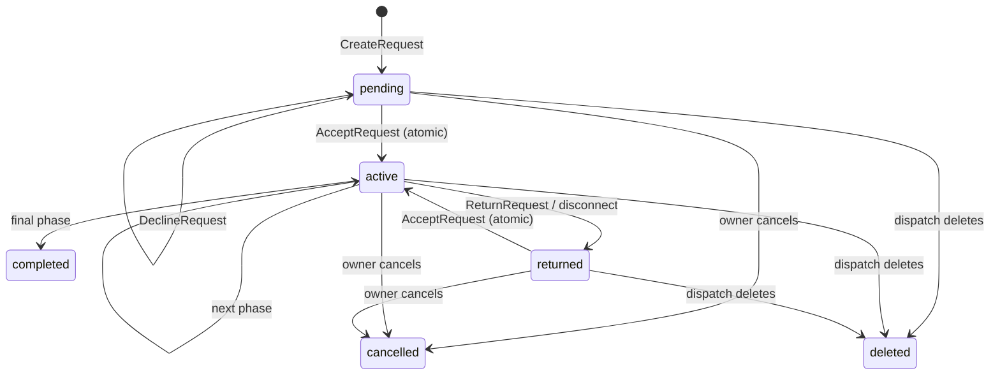

# Services+ API Reference

Resource version: `0.7.0-rc1`
API version: `11`
Status: release-candidate contract

This is the authoritative reference for every supported Services+ integration surface. Internal Lua functions, database tables, and network events not explicitly listed here are implementation details and must not be invoked by another resource.

## Compatibility and Versioning

- Every response and payload is JSON-compatible.
- API version 11 rejects any action payload field that is not declared in its schema, caps every action payload at `Config.MaxActionPayloadBytes` (20000 bytes), replaces client-supplied message `coords` with a server-resolved `includeCurrentLocation` flag, adds an optional `clientRequestId` idempotency key to `createRequest`/`sendCitizenMessage`/`sendEmployeeMessage`, and adds an optional `reoffer` flag to `endCustomCall`.
- API version 10 added composite inbox cursors, server-side workspace summaries and inbox filtering, and schema-driven NUI payload validation.
- Additive fields may appear within the same API major version. Consumers must ignore unknown fields.
- Removing or renaming a documented field, event, export, or semantic behavior requires an API version increment and changelog entry.
- Deprecated contracts remain documented for at least one release cycle when technically possible. There are no deprecated contracts in API version 11.
- Resource exports are the only supported entry point for other server resources. Never trigger `services-plus:server:request` externally.

## Trust Model

Add exact resource names to `Config.ApiAllowedResources`:

```lua
Config.ApiAllowedResources = {
    "your-mdt-resource",
    "your-dispatch-resource"
}
```

`GetInvokingResource()` is checked on every export. The allow-list grants access to the export, not authority over a player: write exports still resolve and validate the supplied online player `source`, employment, duty, status, assignment, company, number, and state transition server-side.

## Response Envelope

All callbacks and exports return exactly one envelope:

```ts
type ApiResponse<T> =
  | { success: true; data: T }
  | { success: false; error: { code: string; message: string; retryable: boolean } };
```

Common errors:

| Code | Retryable | Meaning |
| --- | --- | --- |
| `service_unavailable` | Yes | Services+ has not completed startup or dependency validation. |
| `internal_error` | Yes | A protected handler failed; details are logged server-side. |
| `rate_limited` | Yes | The per-source, per-action limit was exceeded. |
| `invalid_request`, `invalid_payload`, `validation_failed` | No | Shape, type, enum, length, or identifier validation failed, an undeclared payload field was present, or the encoded payload exceeded `Config.MaxActionPayloadBytes`. |
| `phone_required`, `phone_unavailable` | No | An equipped or target LB Phone could not be resolved. |
| `forbidden`, `integration_forbidden` | No | Role, ownership, company, inbox, assignment, or resource authorization failed. |
| `not_on_duty`, `employee_unavailable`, `company_unavailable`, `number_unavailable` | No | Required runtime state is absent. |
| `already_accepted` | No | An atomic call or request assignment was won by another employee. |
| `*_failed` | Varies by contract | A database, LB Phone, or workflow operation did not complete. |

Do not branch on human-readable `message`; use `error.code` and `retryable`.

## Entity Reference

All entities below are API version 11. Optional means the field can be absent, not `null`.

### Company

| Field | Type | Notes |
| --- | --- | --- |
| `id`, `displayName`, `categoryId`, `categoryName` | string | Stable company ID and display metadata. |
| `logo`, `backgroundImage`, `description`, `location`, `openingHours` | string | May be empty. URLs are administrator-validated HTTP(S). |
| `keywords` | string[] | At most 20 administrator-managed terms. |
| `available`, `requestsEnabled`, `hasRequestTemplates`, `messagesEnabled` | boolean | Current public capabilities. |
| `employeeCount`, `version` | number | Active duty count and cache version. |
| `dispatchMode` | `ring_all` \| `random` \| `dispatch_only` | Company default. |
| `primaryNumber` | string, optional | First enabled public call number. |
| `numbers` | CompanyNumber[] | Public operational number states. |

`CompanyNumber` contains `id`, `label`, `number`, `distribution`, `sharedInbox`, `enabled`, `callsEnabled`, `inboxEnabled`, `requestsEnabled`, `publicVisible`, and optional `available`.

### Employee

`EmployeePublic` contains `source`, `name`, `role`, numeric `grade`, `companyId`, `status`, `dispatchEnabled`, `dispatchForced`, `isLeader`, boolean `activeCall` and `activeRequest`, optional `activeCallId` and `activeRequestId`, `activeNumberIds`, and `version`. `status` is `available`, `busy`, `occupied`, `on_break`, or `off_duty`; only `available`, `occupied`, and `on_break` are manually selectable.

`EmployeeIntegration` adds stable `identifier`. That identifier is never included in citizen or normal NUI employee payloads.

### Request

`RequestPublic` contains `id`, `companyId`, optional `companyName`, `templateId`, `requestLabel`, `status`, optional `phaseId`, optional `targetNumberId`, validated `payload`, `createdAt`, and `updatedAt`.

`RequestCompany` adds optional `assignee: { name, role, source? }`.

`RequestIntegration` adds optional `assignee: { identifier, name, role, source? }`, optional server-captured `location: { x, y }`, optional `externalReference: { resource, id }`, and `creatorNumber`. `source` exists only while the assignee is currently on duty. Services+ stores one primary assignee.

### Conversation and Message

`Conversation` contains `id`, `companyId`, `companyName`, `logo`, `numberId`, `numberLabel`, optional `externalNumber`, `lastMessage`, `lastMessageAt`, and `unreadCount`.

`Message` contains `id`, `senderNumber`, `senderType` (`citizen` or `employee`), `body`, up to four HTTP(S) `attachments`, optional `coords: { x, y }`, timestamps, and `reactions: { emoji, count, mine }[]`.

### Settings and Pagination

`AppSettings` contains `directoryTitle`, `callsEnabled`, and `requestsEnabled`. Cursor lists accept integer cursors `>= 1` and limits clamped to `1..50`. Requests and calls are ordered by descending stable ID. Company conversations use `{ lastMessageAt, id }`, ordered by both fields descending, so new activity cannot skip or duplicate older pages. `CompanyWorkspace` exposes separate `nextCursor` and `hasMore` values for every section and a server-derived `summary` with `unansweredRequests`, `unreadMessages`, `unreadByNumber`, `unseenCalls`, and `latestCallId`. Trusted list exports continue with the last item ID until fewer than `limit` items are returned.

## Trusted Server Exports

All exports were introduced by API version 7 and return API version 10 entities where applicable. Every trusted caller is additionally limited per invoking resource: cache and single-record reads use `externalRead`, database lists use `externalList`, and writes use `externalWrite`. Existing per-player write limits remain in force.

| Export | Input | Success data | Access and validation | Rate limit | Side effects and concurrency | Errors |
| --- | --- | --- | --- | --- | --- | --- |
| `GetCompany` | `companyId: string` | Company | Allow-listed resource; existing company ID. | 120/min per invoking resource | None. Restart-safe cache read. | `company_not_found`, common export errors |
| `GetCompanyNumbers` | `companyId: string` | CompanyNumber[] | Same as `GetCompany`. | 120/min per invoking resource | None. | `company_not_found`, common export errors |
| `GetCompanyEmployees` | `companyId: string` | EmployeeIntegration[] | Existing company; only current duty employees returned. | 120/min per invoking resource | None; empty after server restart until duty restoration finishes. | `company_not_found`, common export errors |
| `GetRequest` | `requestId: number` | RequestIntegration | Numeric existing, non-deleted request. | 120/min per invoking resource | None. Soft-deleted requests return `request_not_found`. | `request_not_found`, common export errors |
| `GetCompanyRequests` | `companyId, { cursor?: number, limit?: number, activeOnly?: boolean }` | RequestIntegration[] | Existing company; cursor clamped; limit `1..50`. | 30/min per invoking resource | None. Use the last request ID as next cursor. | `company_not_found`, common export errors |
| `CreateRequest` | `source, { companyId, templateId, values, externalId, locale? }` | RequestIntegration | Allow-listed caller; online source with phone and identity; enabled company/template/fields; `externalId` length `1..96`; locale `en` or `de`. | 6/min per source | Persists request/event and emits creation events. `(invokingResource, externalId)` is unique and retries return the existing request. | `validation_failed`, `requests_disabled`, `template_disabled`, `location_unavailable`, `request_failed`, common errors |
| `AcceptRequest` | `source, requestId` | RequestIntegration | Source is available, on duty, eligible for the request/category/number. | Shared external action: 30/30 sec | Atomic assignment; sets employee Busy; emits accepted lifecycle and pushes. Only one employee can win. | `employee_unavailable`, `already_accepted`, common errors |
| `DeclineRequest` | `source, requestId` | RequestIntegration | Source is eligible and request is pending/returned. | Shared external action: 30/30 sec | Audits personal decline; does not close the request. | `request_unavailable`, common errors |
| `ReturnRequest` | `source, requestId` | RequestIntegration | Source owns the active assignment. | Shared external action: 30/30 sec | Clears assignee, restores employee state, reoffers request, emits returned lifecycle. | `return_failed`, common errors |
| `TransitionRequest` | `source, requestId, phaseId: string` | RequestIntegration | Source owns active assignment; phase is exactly the next configured fixed phase. | 20/30 sec | Atomic next-phase update; final phase completes and releases employee. | `forbidden`, `invalid_transition`, `transition_failed`, common errors |
| `SendCompanyMessage` | `source, messagePayload` | Message event entity | Source is on duty and authorized for the conversation's enabled shared inbox; body <= 2000; <= 4 HTTPS attachments on `Config.AllowedMediaDomains`; valid coords. | 20/min per player plus 60/min per invoking resource | Sends through LB Phone, persists projection, emits message event/push; duplicate LB message IDs are idempotent. | `validation_failed`, `forbidden`, `message_failed`, common errors |

### Export Examples

Read companies, numbers, and employees:

```lua
local company = exports["services-plus"]:GetCompany("lspd")
if not company.success then
    print(("Company read failed: %s"):format(company.error.code))
    return
end

local numbers = exports["services-plus"]:GetCompanyNumbers(company.data.id)
local employees = exports["services-plus"]:GetCompanyEmployees(company.data.id)
if numbers.success and employees.success then
    print(("%s has %d active employees"):format(company.data.displayName, #employees.data))
end
```

Paginate requests:

```lua
local cursor = nil
repeat
    local result = exports["services-plus"]:GetCompanyRequests("lspd", {
        cursor = cursor,
        limit = 25,
        activeOnly = true
    })
    if not result.success then
        print(("Request page failed: %s"):format(result.error.code))
        break
    end
    for _, request in ipairs(result.data) do
        cursor = request.id
        -- Process the sanitized RequestIntegration entity.
    end
until #result.data < 25
```

Create an idempotent MDT request:

```lua
local result = exports["services-plus"]:CreateRequest(playerSource, {
    companyId = "lspd",
    templateId = "police_report",
    values = {
        location = "Mission Row",
        description = "External dispatch reference MDT-4815",
        phone = "5550188"
    },
    externalId = "MDT-4815",
    locale = "en"
})

if not result.success then
    if result.error.retryable then
        -- Retry later with the same externalId; no duplicate is created.
    end
    return
end
local servicesRequestId = result.data.id
```

Perform validated lifecycle actions:

```lua
local accepted = exports["services-plus"]:AcceptRequest(officerSource, requestId)
if accepted.success then
    local moved = exports["services-plus"]:TransitionRequest(officerSource, requestId, "on_scene")
    if not moved.success then print(moved.error.code) end
else
    print(accepted.error.code)
end

-- These use the same employee authority checks:
exports["services-plus"]:DeclineRequest(officerSource, anotherRequestId)
exports["services-plus"]:ReturnRequest(officerSource, requestId)
```

## Local Server Events

These are same-context FiveM server events emitted with `TriggerEvent`; they are not network events. Any resource can technically register a listener, but they are supported only for trusted server integrations. API version 10 request events always use `RequestIntegration`.

| Event | Payload | Emitted after | Notes |
| --- | --- | --- | --- |
| `services-plus:server:requestLifecycle` | `{ event, version, timestamp, request: RequestIntegration }` | Every lifecycle change | Preferred stable event. `event`: `created`, `accepted`, `phase_changed`, `returned`, `completed`, `cancelled`, `deleted`. |
| `services-plus:server:requestCreated` | RequestIntegration | Successful create | Compatibility-specific event. |
| `services-plus:server:requestUpdated` | RequestIntegration | Accepted, transitioned, returned, completed, cancelled, or deleted | General compatibility event. |
| `services-plus:server:requestAccepted` | RequestIntegration | Atomic acceptance | Assignment is already committed. |
| `services-plus:server:requestPhaseChanged` | RequestIntegration | Non-final next phase | Fixed sequential transition already committed. |
| `services-plus:server:requestReturned` | RequestIntegration | Manual return or disconnect recovery | Assignment has been cleared. |
| `services-plus:server:requestCompleted` | RequestIntegration | Final phase | Employee has been released. |
| `services-plus:server:requestCancelled` | RequestIntegration | Citizen cancellation | Any assignee has been released. |
| `services-plus:server:requestDeleted` | RequestIntegration | Dispatch soft deletion | Record remains auditable but is hidden from normal reads. |
| `services-plus:server:messageReceived` | Message event entity | Persisted citizen or employee message | Contains `conversationId`, `messageId`, company/number IDs, number label, external number, body, sender type, attachments, coords, and `createdAt`. |

Listen and correlate external dispatch state:

```lua
AddEventHandler("services-plus:server:requestLifecycle", function(update)
    if update.version ~= 11 then return end
    local request = update.request
    local external = request.externalReference
    local externalId = external and external.id or nil

    -- Store Services+ request.id beside the external dispatch record.
    MyDispatch.LinkServicesRequest(externalId, request.id, update.event)
end)
```

Services+ intentionally owns one primary assignee. Patrol units, multiple officers, vehicles, radio state, and live officer/vehicle locations remain in the MDT or dispatch resource and should be keyed by the Services+ request ID.

## Request Lifecycle



On Services+ startup, orphaned `active` requests are returned and assignments are cleared. External creation is idempotent. Acceptance uses a conditional database update so concurrent employees cannot both win.

## Call Lifecycle

1. LB Phone starts a native call to a registered company number.
2. Services+ creates or reuses a unique queue token and selects eligible employees according to `ring_all`, `random`, or `dispatch_only`.
3. `acceptCall` atomically assigns one employee, then the client accepts the native LB Phone call.
4. Declines are per employee; an exhausted offer returns to the queue for reoffer.
5. `lb-phone:callEnded`, employee disconnect, LB Phone stop, or Services+ recovery ends the queue record and releases employee state.

Services+ coordinates routing metadata only. LB Phone owns audio, call UI, and native call state.

## Message and Shared-Inbox Flow

1. A citizen selects an enabled public number and sends text, up to four gallery URLs, or coordinates through LB Phone.
2. Services+ validates the equipped sender number and target channel, invokes LB Phone, then persists a number-specific inbox projection.
3. Only on-duty employees authorized for that enabled shared inbox receive `inbox.message`.
4. Employee replies use the company number and existing LB Phone channel.
5. Message reactions are allow-listed and stored per actor. Dispatch deletion is a Services+ soft delete and does not rewrite LB Phone history.

## App Action Contracts

The NUI calls a local client callback. The client sends `services-plus:server:request(requestId, action, payload)` and waits up to `Config.ServerCallbackTimeoutMs`. The server checks request ID length `8..96`, action allow-list, readiness, per-action rate limit, and protected handler execution, then sends exactly one response to the requesting player. This transport is internal and unsupported for third-party resources.

Version for all action contracts: API 8. Errors marked below are contract-specific in addition to common errors.

### State, Duty, and Operations

| Action and input | Success data | Permission and validation | Limit | Effects / errors |
| --- | --- | --- | --- | --- |
| `getInitialState {}` | InitialState | Equipped phone; resolves framework identity and employment. | 12/min | Adds app subscriber; read only. `phone_required`. |
| `enterDuty {}` | `{ employee, currentUser, companies }` | Equipped phone; mapped company employment; no existing conflicting session. | 5/30 sec | Creates restart-restorable duty state and number registrations. |
| `leaveDuty {}` | `{ currentUser, companies }` | On duty; no active call/request. | 5/30 sec | Clears duty and number registrations. `employee_busy`. |
| `updateStatus { status }` | EmployeePublic | On duty; mutable status enum only. | 15/30 sec | Revalidates offers/coverage. `invalid_status`, `employee_busy`. |
| `toggleDispatch { enabled: boolean }` | EmployeePublic | On duty; boolean. | 10/30 sec | Selects all lines initially when enabled; rebalances routing. |
| `updateCompanyOperations { companyId, patch }` | Company | Leader of same company; boolean request/message flags and distribution enum. | 8/min | Persists operations and pushes company delta. `forbidden`, `validation_failed`. |
| `updateNumberOperations { numbers }` | Company | Same-company leader; <= 10 existing number IDs and complete boolean/distribution patch. | 8/min | Persists channel flags, resyncs numbers and offers. `number_not_found`, `number_update_failed`. |
| `toggleDispatchLine { numberId, enabled }` | EmployeePublic | Active dispatcher; existing enabled number. | 20/min | Changes current duty-session line selection. `dispatch_required`, `number_not_found`. |
| `getCompanyWorkspace { sections?, cursors?, conversationNumberId?, seenCallId?, includeSummary?, limit?, locale? }` | CompanyWorkspace | On-duty employee; `sections` contains any of `conversations`, `requests`, `calls`; each matching cursor is independent; the optional inbox must be enabled and shared; pagination `1..50`. | 15/min | Filters conversations in SQL. Conversation cursors are `{ lastMessageAt, id }`; request/call cursors remain integers. `summary` is returned unless `includeSummary` is false. Omitted sections are empty. `not_on_duty`, `inbox_disabled`, `invalid_payload`. |

### Calls and Contacts

| Action and input | Success data | Permission and validation | Limit | Effects / errors |
| --- | --- | --- | --- | --- |
| `startCompanyCall { companyId, numberId? }` | `{ number, companyId }` | Equipped phone; global/company/number enabled, public, covered. | 8/30 sec | Records owned call attempt; UI starts native LB Phone call. `company_unavailable`, `number_unavailable`. |
| `getEmployeeContact { targetSource }` | `{ number }` | Equipped phone; different active colleague in same company. | 10/30 sec | Resolves target's equipped number. `invalid_target`, `phone_unavailable`. |
| `registerIncomingCall { callToken, number }` | `{ id, state, offered, callToken, position }` | On-duty employee belongs to resolved company; token length `1..96`. | 20/30 sec | Idempotently attaches employee/native offer. `invalid_call`, `forbidden`. |
| `acceptCall { id }` | `{ id, callToken }` | Available eligible offered employee. | 8/30 sec | Atomic assignment and Busy state; client native handoff may add `native_call_unavailable`. `already_accepted`. |
| `declineCall { id }` | `{ id }` | Employee was offered current call. | 12/30 sec | Records runtime decline and may requeue. `call_unavailable`, `forbidden`. |
| `endCustomCall { callToken, reoffer? }` | `{ ended: true }` | Caller or the currently assigned employee for the token; token length `1..96`. | 12/30 sec | Ends the call. When `reoffer` is set by the assigned employee (native handoff failure) the call is instead returned to `queued`/`offered` and re-offered to other eligible employees instead of ending. `invalid_call`. |

### Requests

| Action and input | Success data | Permission and validation | Limit | Effects / errors |
| --- | --- | --- | --- | --- |
| `getRequestOptions { companyId, locale }` | RequestSettings | Equipped phone; enabled company with specialized templates. | 15/min | Bounded configuration read and equipped-number default. `requests_disabled`. |
| `createRequest { companyId, templateId, values, locale?, clientRequestId? }` | RequestPublic | Equipped phone; enabled target/template; server validates every configured field and location. | 4/min | Persists and offers request. When `clientRequestId` repeats within 20 seconds for the same player, the original result is replayed instead of creating a duplicate request. `template_disabled`, `location_unavailable`, `request_failed`. |
| `acceptRequest { id }` | RequestCompany | Available eligible employee. | 8/30 sec | Atomic assignment, Busy state, optional waypoint, lifecycle events. `already_accepted`. |
| `declineRequest { id }` | `{ id }` | Eligible employee; pending/returned request. | 12/30 sec | Audits personal decline. `request_unavailable`. |
| `transitionRequest { id, phaseId }` | RequestCompany | Assigned employee; exactly next fixed phase. | 15/30 sec | Updates or completes request. `invalid_transition`, `transition_failed`. |
| `returnRequest { id }` | RequestCompany | Assigned employee. | 8/30 sec | Clears assignment, restores employee, reoffers. `return_failed`. |
| `cancelRequest { id }` | RequestPublic | Framework identity owns request. | 6/min | Cancels and releases assignment. `cancel_failed`. |
| `deleteRequest { id }` | `{ id }` | Active dispatch of owning company. | 10/min | Audited soft delete; call history unaffected. `forbidden`, `request_unavailable`. |
| `updateRequestSettings { settings }` | RequestSettings | Same-company leader; labels `2..80`, valid templates/fields/number/navigation enum. | 6/min | Persists controlled company overrides; phases remain fixed. `validation_failed`. |

### Messages, Activity, and Administration

| Action and input | Success data | Permission and validation | Limit | Effects / errors |
| --- | --- | --- | --- | --- |
| `sendCitizenMessage { companyId, numberId?, body, attachments?, includeCurrentLocation?, clientRequestId? }` | Message event | Equipped phone; enabled public shared inbox; body <= 2000, <= 4 HTTPS attachments on `Config.AllowedMediaDomains`. | 12/min | Sends via LB Phone, persists and pushes. `includeCurrentLocation` makes the server read the sender's own position with `GetEntityCoords`; the client cannot supply arbitrary coordinates. `clientRequestId` deduplicates retries for 20 seconds. `inbox_disabled`, `message_failed`. |
| `sendEmployeeMessage { conversationId, body, attachments?, includeCurrentLocation?, clientRequestId? }` | Message event | On duty and authorized for enabled shared inbox; same content limits. | 20/min | Replies as company number and persists. Same server-resolved location and retry deduplication as `sendCitizenMessage`. `forbidden`, `message_failed`. |
| `getCitizenInbox { cursor?, limit? }` | Conversation[] | Equipped phone number owns conversations. | 15/min | Bounded read. `phone_required`. |
| `getConversationMessages { conversationId, citizen, cursor?, limit? }` | `{ conversation, messages }` | Citizen number owns conversation or employee has same-company number access. | 20/min | Bounded read; employee read cursor updated. `forbidden`. |
| `reactToMessage { messageId, emoji, citizen }` | `{ messageId, conversationId, reactions }` | Authorized participant; emoji from fixed ten-item allow-list. | 30/min | Toggle per-actor reaction and push update. `message_unavailable`, `forbidden`. |
| `deleteConversation { id }` | `{ id }` | Active owning-company dispatch with number access. | 10/min | Audited Services+ soft delete only. `conversation_unavailable`. |
| `deleteMessage { id }` | `{ id, conversationId }` | Active owning-company dispatch with number access. | 20/min | Audited Services+ soft delete only. `message_unavailable`. |
| `getMyActivity { limit? }` | `{ calls, requests }` | Equipped phone and framework identity; limit `1..50`. | 12/min | Owned bounded history read. `player_unavailable`. |
| `getAdminState {}` | AdminState | Equipped phone and ACE/framework administrator. | 8/min | Protected configuration read; `AdminState.deletedCompanies` lists soft-deleted companies (`id`, `job`, `displayName`, `logo?`, `categoryId`, `deletedAt`, `deletedBy?`) for restoration. `forbidden`. |
| `adminSaveCompany { company }` | Company | Administrator; IDs/slugs, lengths, URLs, known category/enums, <= 20 keywords, <= 10 unique numbers. | 10/min | Upsert, cache reload, employee/call revalidation, company push. `company_limit_reached`, `validation_failed`. |
| `adminDeleteCompany { companyId }` | `{ id }` | Administrator; existing company. | 5/min | Soft-deletes the company (`deleted_at`/`deleted_by`), soft-deletes its numbers, invalidates duty, pushes deletion. The `id` and every number are reserved and excluded from active reads but are not physically removed, so call/request/conversation history stays readable. Saving a company with the same `id` or a number reusing the same phone number revives the soft-deleted row. `company_not_found`. |
| `adminRestoreCompany { companyId }` | Company | Administrator; `companyId` currently soft-deleted. | 5/min | Clears `deleted_at`/`deleted_by` on the company and on every number that was soft-deleted alongside it, reloads the cache, pushes `company.updated`. `company_not_deleted` (the id is active or was never used), `company_not_found` (the id was never soft-deleted). |
| `adminUpdateSettings { settings }` | AppSettings | Administrator; title `2..80`, boolean global flags. | 8/min | Persists and pushes settings. `settings_update_failed`. |
| `adminUpdateCategory { categoryId, requestCompetition }` | Category | Administrator; known category and boolean. | 12/min | Persists competition, refreshes offers, pushes category. `category_update_failed`. |

### Local NUI Helpers

| Callback | Purpose | Server action / side effect |
| --- | --- | --- |
| `acceptCall` | Completes native LB Phone handoff after server acceptance. | Uses `acceptCall`; on native failure calls `endCustomCall` and answers with `native_call_unavailable`. |
| `openEmployeeContact { targetSource }` | Opens LB Phone contact modal. | Uses `getEmployeeContact`; client invokes `SetContactModal`. |
| `sendCurrentLocation { citizen, ...target }` | Requests that the current player position is attached to a message. | Converts to `sendCitizenMessage`/`sendEmployeeMessage` with `includeCurrentLocation: true`; the server reads the actual position, the client sends no coordinates. |

## Custom App Push Messages

Server pushes arrive through the client and official LB Phone `SendCustomAppMessage` as `{ type, version?, timestamp, payload }`. Audience is always targeted; Services+ does not broadcast these globally.

| Type | Audience | Payload / behavior |
| --- | --- | --- |
| `company.updated` | Opened/subscribed app clients | Company delta after availability/config changes. |
| `company.deleted` | Subscribed app clients | `{ id }`; remove company. |
| `settings.updated` | Subscribed app clients | AppSettings. |
| `category.updated` | Subscribed app clients | Category with competition state. |
| `employee.updated` | On-duty company members | EmployeePublic delta. |
| `employee.removed` | On-duty company members | `{ companyId, source, reason }`. |
| `session.invalidated` | Affected employee | `{ reason }`; clears portal session. |
| `call.offer` | Selected eligible employee | `{ id, callToken, companyId, companyName, numberId, numberLabel }`. |
| `call.offer.removed` | Previously offered employee | `{ id, callToken }`; dismiss offer. |
| `call.accepted.local` | Winning employee | `{ id, callToken }`; native call is accepted. |
| `call.queue` | Calling citizen | `{ id, companyId?, position, status }`. |
| `request.offer` | Eligible available employees | RequestCompany. |
| `request.offer.removed` | Employee with stale/lost offer | `{ id }`. |
| `request.updated` | Relevant company employees | RequestCompany delta. |
| `request.citizen.updated` | Connected request owner | RequestPublic. |
| `inbox.message` | Authorized number inbox employees | Message event entity. |
| `inbox.reaction` | Authorized employees and connected citizen | `{ messageId, conversationId, reactions }`. |
| `inbox.deleted` | Authorized inbox employees | `{ id, companyId }`. |
| `inbox.message.deleted` | Authorized inbox employees | `{ messageId, conversationId }`. |

## Permissions Matrix

| Capability | Citizen | Employee | Dispatch | Leader | Administrator | Trusted resource |
| --- | --- | --- | --- | --- | --- | --- |
| Read public directory / own activity | Yes | Yes | Yes | Yes | Yes | Via read exports |
| Create/cancel own request | Yes | Yes | Yes | Yes | Yes | Create via export with validated source |
| Citizen message/call | Yes | Yes | Yes | Yes | Yes | No direct citizen call export |
| Duty, status, company workspace | No | Own company | Own company | Own company | Only if employed | Employee exports are read-only |
| Accept/transition/return work | No | If eligible/assigned | If eligible/assigned | If eligible/assigned | No role bypass | Validated action exports |
| Delete requests/messages | No | No | Own company | Only while dispatch | No role bypass | No delete export |
| Company operational/request settings | No | No | No | Own company | Admin UI can change full company | No write export |
| Company identity/numbers/global/category config | No | No | No | No | Yes | Read exports only |
| Stable employee identifiers / request integration fields | No | No | No | No | No NUI exposure | Yes, allow-listed server only |

## Optional Adapter Hooks

`Config.OptionalIntegrations` defines disabled-by-default boundaries for `notifications`, `dispatch`, `billing`, `inventory`, and `map`. Services+ currently exposes availability checks only; it does not call an undocumented third-party API. An enabled missing resource logs one warning and core behavior remains available. Implement adapters in `integrations/server.lua`, retain server authorization/rate limits, and document every new supported hook here before release.

## Security Rules for Consumers

- Never forward a client-selected `source`, company, role, amount, assignee, or identifier directly into an export without server-owned context.
- Treat `source` as ephemeral and `identifier` as sensitive. Use request ID for cross-resource correlation.
- Handle every envelope and `retryable` flag; do not assume exports throw.
- Retry `CreateRequest` only with the same stable `externalId`.
- Do not persist or display integration-only identifiers to citizens.
- Do not invoke internal network events or query Services+ tables directly.
